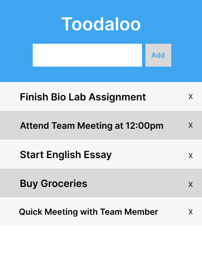

# Technical Product Report

This is a product report of our to-do-list extension for the second phase.

**UI Draft Design**

The image displayed below is a draft design for how the to-do list looks when displayed
on the web browser extension. We used Figma, a user interface web application, to
create the design because of its user-friendliness and accessibility. Some of our team 
members have some experience with Figma, which also impacted our decision to use it. 
We opted for a simplistic design to start with because we aimed for a user-friendly 
appearance. Another factor for our decision for a simple design is that we did not want 
to focus heavily on its appearance and put more attention to its functionality for our first demo. 

**Features Built During This Phase**
- **Sidebar to display the to-do list**
  - When opened, the sidebar is displayed next to the current webpage that 
  the user is on and it shows the to-do list. The sidebar has the option to be 
  displayed on the left or right side of the webpage. 
  
  - Our team decided to use a sidebar to display our extension instead of a popup 
  or other means of display because we wanted the to-do list to be shown right beside 
  the webpage. This allows users to view and keep track of their to-do list on the 
  side while working on their tasks on the web browser. We also took into account that 
  the sidebar will not block the view of the webpage the user is currently on, unlike a popup.
  
- **Context menu to open the to-do list**
  - Although the sidebar can be opened from the browser toolbar, it can also be opened from a context menu.
  
  - The decision behind having a context menu to open the extension was for users to quickly open their to-do 
  list if preferred instead of going to the browser toolbar. 
  
- **Add a task**
  - The add feature allows users to add tasks to the list. It includes an input form for users to name 
  their task that they want to add and a button to submit it.
  
  - Vital for our extension as this is the main point of our extension is for users to add and keep 
  track of tasks and this feature was our main priority as it would be for our users as well. 
  
- **Check/cross off a task on the list**
  - This feature allows users to click on a task to check it off, which indicates that it has been
  completed. When clicking on the task, the task will have a check mark beside it and the text will
  be crossed off with a line.
  
  - We decided to have it so that users can keep track of completed tasks and which tasks they still need to do.
  
- **Delete a task**
  - Users can delete their tasks by clicking on the delete button indicated as an ‘x’. Each task in the list has 
  a delete button right beside it so users can delete the tasks they want.
  
  - This allows users to keep a clean and organized task list not littered with past tasks already 
  completed the user doesn’t wish to see anymore.

**Technical Highlights:**
- One challenge we faced was bugs with the add button as the Javascript file wouldn't run when the button was pressed. 
Originally the function call was in the html code of the button but after not finding the bug we changed the button to 
a simple button on the html side and added an eventlistener in the javascript which would call the javascript from 
there which made our button work.

- One main challenge we faced is that not all of our team was familiar with Javascript or HTML which are the primary 
languages used in our extension. So to start, we divided work based on who knew what as a member who knew Javascript 
would focus not just on building that portion of the code but explaining it to other members who could make changes 
or improve upon the code built. This approach helped us learn a new language although it shouldn't be hard at our level. 
It is still better when our group members help each learn and understand what we are building and that was a learning 
experience for the whole group.

**Reflection on Teamwork/Process:**

- Working as a team on a project like this was a new experience to most of us, we learned
because of that. Whether it be working together on the code of our project which required
teamwork and meetings as some members were more familiar with the code languages than others.

- Another part of our process that was the design of the code as that way if one of us was coding 
on a specific feature we would coordinate as to plan. So when one person codes one part, 
it wouldn't break the code another person was coding and this let us prevent conflicting code and saved time to fix issues we didn't cause.

- One major weakness of our process would have to be documentation as we didn’t use Github 
and Github Desktop until recently and this is an important documentation used in the real workforce that we would start taking very seriously and track.

- One crucial part of our process was meeting minutes where we kept track of what we did every meeting through discord and
created meeting minutes based of our logs.( [Meeting Minutes](https://github.com/4540Group5/toodaloo/blob/main/Meeting%20Notes.pdf))

**Future/Possible Features to Implement:**
- Save tasks on to-do list when closing the extension/sidebar
- Allow users to input a date and time when adding a task.
- “Completed Goals” tab highlighting previous tasks completed by the user.
- Allow user to import task from other sources
- Allow users to create multiple lists to keep track of different tasks etc school, personal life tasks.
- Add list themes for user to chose.(This is an aesthetic feature not priority).
